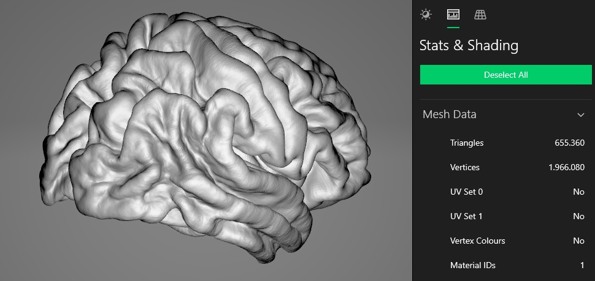

# FreeSurfer Vagrant Automation

## Description
This repository will use vagrant and FreeSurfer to analyze MRI scans and generate a STL file from a brain.  
By adjusting the Vagrantfile the mount of available resources can be adjusted (CPU, memory) as well as the software itself.  
Vagrant will download the Ubuntu image, create a virtual machines (VM), download FreeSurfer, perform the installation, and start the processing. 



If you want to look at a simple Vagrantfile and learn how you can use it for other projects this repository is for you.  
If you have to test FreeSurfer and don't want deal with the installation yourself this repository might be helpful.  

The FreeSurfer project provides a VirtualBox image, but it is outdated.  
This was a Sunday project just for fun. Use with caution for real world scenarios.

## Requirements

### Tools
Install [Virtualbox](https://www.virtualbox.org/wiki/Downloads) and [Vagrant](https://www.vagrantup.com/downloads)

### License File
Get your free license here:
[How to get a license](https://surfer.nmr.mgh.harvard.edu/fswiki/License)

You get the license.txt file send by email and you have to copy it into the main folder next to the Vagrantfile.

## Input Files
Copy your DICOM files into the input folder.  
You will have multiple file in one series. The script will just use the first filename it can find in the folder. The corresponding files from the same series will be automatically detected.  

Example structure:
```
PS C:\lab\FreeSurfer-Vagrant> dir input
    Directory: C:\lab\FreeSurfer-Vagrant\input
Mode     LastWriteTime    Length Name
----     -------------    ------ ----
-a----   mm/dd/yyyy       575420 I11_0001
-a----   mm/dd/yyyy       575420 I11_0002
-a----   mm/dd/yyyy       575420 I11_0003
[...]
```

## Run 
When you have everything prepared open up a command prompt an execute:
```
vagrant up
```
It will read the Vagrantfile in the current folder and execute the steps outlined.  
After completion the generated files will be moved into the output directory.  
**WARNING:** All data in the output directory will be deleted on every start. Move out the data you need before you start another run. 

To run another analysis change the files in the input directory and run:
```
vagrant reload
```

To delete the VM:
```
vagrant destroy
```

## Output Files
The output folder will contain the FreeSurfer subjects folder and includes also the sample files included in the tool. You are probably most interested in the "Subject1" subfolder. You can open those files in [freeview](https://surfer.nmr.mgh.harvard.edu/fswiki/FsTutorial/OutputData_freeview).  
It will also generate a STL file that can be used in 3D programs and can even be 3d printed.  

Example structure:
```
PS C:\lab\FreeSurfer-Vagrant> dir output/*
    Directory: C:\lab\FreeSurfer-Vagrant\output
Mode     LastWriteTime    Length Name
----     -------------    ------ ----
d-----   mm/dd/yyyy              freesurfer
d-----   mm/dd/yyyy              stl

PS C:\lab\FreeSurfer-Vagrant> dir output/freesurfer/subjects/
    Directory: C:\lab\FreeSurfer-Vagrant\output\freesurfer\subjects
Mode     LastWriteTime    Length Name
----     -------------    ------ ----
[...]
d-----   mm/dd/yyyy              Subject1
[...]

PS C:\lab\FreeSurfer-Vagrant> dir output/stl
    Directory: C:\lab\FreeSurfer-Vagrant\output\stl
Mode     LastWriteTime    Length Name
----     -------------    ------ ----
-a----   mm/dd/yyyy     16831684 brain.stl
```

To learn more about the output the tools produces watch this [Video](https://www.youtube.com/watch?v=8Ict0Erh7_c)

## Credit
I got the idea to use FreeSurfer from [https://imgur.com/a/3mFsX](https://imgur.com/a/3mFsX)